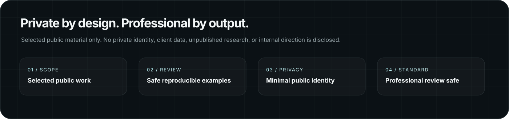
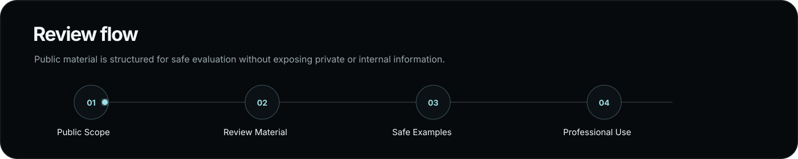

<div align="center">

<a href="https://hackerhacks-attacks.github.io">
  
</a>
<a href="https://github.com/hackerhacks-attacks">
  
</a>

</div>

<div align="center">


<br>

<div align="center">


</div>


<div align="center">


</div>


<br><br>

<table>
<tr>
<td align="center"><b>Technical Work</b></td>
<td align="center"><b>Minimal Identity</b></td>
<td align="center"><b>Verifiable Output</b></td>
</tr>
<tr>
<td align="center"><code>documented</code></td>
<td align="center"><code>privacy-conscious</code></td>
<td align="center"><code>review-ready</code></td>
</tr>
</table>

</div>

---

## Public Scope

<table>
<tr>
<td width="60%">

This profile is intentionally limited.

Only selected public work is shown here. Personal identity, non-public projects, private research, client/employer details, and unpublished work are not disclosed on this profile.

</td>
<td width="40%">

```text
PUBLIC PROFILE
├─ selected artifacts only
├─ safe review material
├─ minimal identity exposure
└─ private work excluded
```

</td>
</tr>
</table>

---

<div align="center">



</div>

---

## What This Profile Shows

<table>
<tr>
<td width="50%">

### Technical Documentation

Security-focused notes, controlled review material, and clear written explanations.

```text
status: public-review-safe
scope: selected material only
```

</td>
<td width="50%">

### Authorized Lab Work

Lab-based examples designed for safe review in controlled environments.

```text
scope: owned / authorized / lab
output: reproducible where appropriate
```

</td>
</tr>
<tr>
<td width="50%">

### Systems-Oriented Analysis

Architecture, trust boundaries, hardening concepts, and technical reasoning.

```text
focus: systems thinking
signal: defensive value
```

</td>
<td width="50%">

### Security Utilities

Small tools, scripts, parsers, helpers, and automation where appropriate.

```text
purpose: practical support
release: selected only
```

</td>
</tr>
</table>

---

## Focus Areas

<table>
<tr>
<th align="left">Area</th>
<th align="left">Review Value</th>
<th align="left">Public Signal</th>
</tr>
<tr>
<td><b>Secure Systems</b></td>
<td>Architecture review, trust boundaries, hardening logic, and systems-level security thinking.</td>
<td><code>design</code> <code>risk</code> <code>control</code></td>
</tr>
<tr>
<td><b>Security Research</b></td>
<td>Controlled analysis, methodology, vulnerability-class study, and defensive implications.</td>
<td><code>method</code> <code>evidence</code> <code>review</code></td>
</tr>
<tr>
<td><b>Detection Engineering</b></td>
<td>Telemetry interpretation, behavior mapping, detection logic, and incident evidence.</td>
<td><code>signal</code> <code>logs</code> <code>logic</code></td>
</tr>
<tr>
<td><b>Technical Documentation</b></td>
<td>Clear writing, reproducible notes, and professional explanation of security work.</td>
<td><code>clarity</code> <code>proof</code> <code>structure</code></td>
</tr>
</table>

---

<div align="center">



</div>

---

## Review Standard

<table>
<tr>
<td align="center" width="20%"><b>Clear</b><br><sub>readable structure</sub></td>
<td align="center" width="20%"><b>Reproducible</b><br><sub>safe examples only</sub></td>
<td align="center" width="20%"><b>Ethical</b><br><sub>authorized scope</sub></td>
<td align="center" width="20%"><b>Professional</b><br><sub>review-ready</sub></td>
<td align="center" width="20%"><b>Private</b><br><sub>minimal exposure</sub></td>
</tr>
</table>

```text
REVIEW STANDARD
├─ clear
├─ reproducible where appropriate
├─ ethical
├─ professionally written
├─ safe for professional review
└─ free from unnecessary personal disclosure
```

---

## Professional Boundaries

<table>
<tr>
<td width="50%">

```text
AUTHORIZED SCOPE
├─ owned environments
├─ controlled lab environments
├─ approved review material
└─ sensitive targets excluded
```

</td>
<td width="50%">

```text
PUBLIC OUTPUT
├─ evidence-based claims
├─ safe examples only
├─ private identity minimized
└─ technical value prioritized
```

</td>
</tr>
</table>

- Work is limited to owned, authorized, or controlled environments.
- Public writeups avoid sensitive targets, private data, or unsafe disclosure.
- Claims are kept evidence-based and technically reviewable.
- Personal identity is minimized; technical output is prioritized.
- Public examples are designed for safe review and reproduction only where appropriate.

---

## Public Repositories

Please review the pinned repositories and repository READMEs for available public work.

Private work, unpublished research, non-public projects, client/employer details, and personal identity information are not listed here.

```text
PUBLIC REPOSITORIES
└─ selected artifacts only

PRIVATE / UNPUBLISHED WORK
└─ not listed, not disclosed, not implied
```

---

## License & Usage Notice

Unless a repository contains an explicit license file stating otherwise, all code, files, documentation, notes, designs, and related materials are provided for review only.

No permission is granted to copy, reproduce, modify, redistribute, repackage, train on, mirror, commercialize, or create derivative works from this material without prior written authorization.

Viewing this profile or any public repository does not grant ownership, transfer rights, or permission to reuse the work outside its stated review context.

```text
USAGE STATUS
viewing: allowed
review: allowed
copying: not granted
modification: not granted
redistribution: not granted
derivative works: not granted
commercial use: not granted
```

---

<div align="center">

## Researching the unseen.

<table>
<tr>
<td align="center"><b>Private by design.</b></td>
<td align="center"><b>Professional by output.</b></td>
</tr>
</table>

</div>
