<div align="center">



<br>


<br><br>

</div>

<div align="center">


</div>

<br>

<div align="center">

<table>
<tr>
<td align="center"><b>Technical Work</b></td>
<td align="center"><b>Minimal Identity</b></td>
<td align="center"><b>Verifiable Output</b></td>
</tr>
<tr>
<td align="center"><code>documented</code></td>
<td align="center"><code>privacy-conscious</code></td>
<td align="center"><code>review-ready</code></td>
</tr>
</table>

</div>

---

## Public Scope

<table>
<tr>
<td width="62%">

This profile is intentionally limited.

Only selected public work is shown here. Personal identity, non-public projects, private research, client/employer details, and unpublished work are not disclosed on this profile.

</td>
<td width="38%">

```text
PUBLIC PROFILE
├─ selected artifacts only
├─ safe review material
├─ minimal identity exposure
└─ private work excluded
